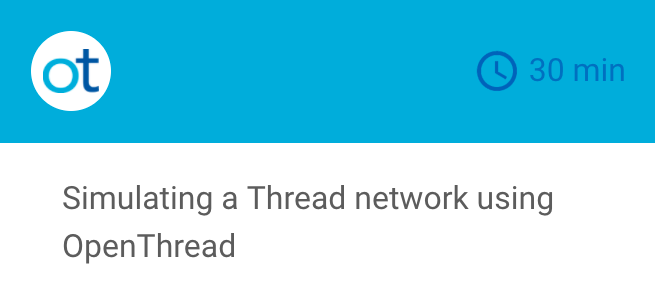

[![OpenThread][ot-logo]][ot-repo]  
[![Build Status][ot-travis-svg]][ot-travis]
[![Build Status][ot-appveyor-svg]][ot-appveyor]
[![Coverage Status][ot-codecov-svg]][ot-codecov]

---

# What is OpenThread?  

OpenThread is...

**...an open-source implementation of the [Thread](http://threadgroup.org/technology/ourtechnology) networking protocol.** Nest has released OpenThread to make the technology used in Nest products more broadly available to developers to accelerate the development of products for the connected home.

**...OS and platform agnostic**, with a narrow platform abstraction layer and a small memory footprint, making it highly portable.

**...a Thread Certified Component**, implementing all features defined in the [Thread 1.1.1 specification](http://threadgroup.org/technology/ourtechnology#specifications). This specification defines an IPv6-based reliable, secure and low-power wireless device-to-device communication protocol for home applications.

More information about Thread can be found on [threadgroup.org](http://threadgroup.org/).

[thread]: http://threadgroup.org/technology/ourtechnology
[ot-repo]: https://github.com/openthread/openthread
[ot-logo]: doc/images/openthread_logo.png
[ot-travis]: https://travis-ci.org/openthread/openthread
[ot-travis-svg]: https://travis-ci.org/openthread/openthread.svg?branch=master
[ot-appveyor]: https://ci.appveyor.com/project/jwhui/openthread
[ot-appveyor-svg]: https://ci.appveyor.com/api/projects/status/r5qwyhn9p26nmfk3?svg=true
[ot-codecov]: https://codecov.io/gh/openthread/openthread
[ot-codecov-svg]: https://codecov.io/gh/openthread/openthread/branch/master/graph/badge.svg

# Get started with OpenThread

Want to try OpenThread? The quickest way to get started is to run through our [Simulation Codelab](https://codelabs.developers.google.com/codelabs/openthread-simulation/index.html), which covers all the basics, without the need for test hardware. Using VirtualBox and Vagrant on a Mac or Linux machine, you will learn:

* How to set up the OpenThread build toolchain
* How to simulate a Thread network
* How to authenticate Thread nodes with Commissioning
* How to use `wpantund` to manage a simulated Thread network featuring an NCP

### Next Steps

The Codelab shows you how easy it is use to OpenThread to simulate a Thread network. Once complete:

1. Learn more about the [OpenThread architecture and features](#openthread-features)
1. Get familiar with [platforms and devices that support OpenThread](#who-supports-openthread)
1. See what [testing tools](#what-tools-are-available-for-testing) are available
1. Learn [where to get help](#need-help) and [how to contribute](#want-to-contribute) to the ongoing development of OpenThread

# OpenThread Features

OpenThread implements all features defined in the [Thread 1.1.1 specification](http://threadgroup.org/technology/ourtechnology#specifications), including all Thread networking layers (IPv6, 6LoWPAN, IEEE 802.15.4 with MAC security, Mesh Link Establishment, Mesh Routing) and device roles.

OpenThread supports both system-on-chip (SoC) and network co-processor (NCP) designs. Other features and enhancements include:

* Application support and services
    * IPv6 configuration and raw data interface
    * UDP sockets
    * CoAP client and server
    * DHCPv6 client and server
    * DNSv6 client
    * Command Line Interface (CLI)
* NCP support
    * Spinel - general purpose NCP protocol
    * `wpantund` - user-space NCP network interface driver/daemon
    * Sniffer support via NCP Spinel nodes

### What's coming?

The development of OpenThread is ongoing to regularly provide additional features not available in the standard. Currently, we are working on:

* Host-side Border Agent support

# Who supports OpenThread?

Led by Nest, the following companies are contributing to the ongoing development of OpenThread:

OpenThread has been ported to several devices and platforms. Build examples are included in the OpenThread project.

### IEEE 802.15.4 Platform Support

* [Dialog Semiconductor DA15000](https://github.com/openthread/openthread/wiki/Platforms#dialog-da15000)
* [Nordic Semiconductor nRF52840](https://github.com/openthread/openthread/wiki/Platforms#nordic-semiconductor-nrf52840)
* [Silicon Labs EFR32](https://github.com/openthread/openthread/wiki/Platforms#silicon-labs-efr32)
* [Texas Instruments CC2538](https://github.com/openthread/openthread/wiki/Platforms#texas-instruments-cc2538)
* [Texas Instruments CC2650](https://github.com/openthread/openthread/wiki/Platforms#texas-instruments-cc2650)
* [POSIX Emulation](https://github.com/openthread/openthread/wiki/Platforms#posix-emulation)

See the [Wiki Platform page](https://github.com/openthread/openthread/wiki/Platforms) for more detailed information on supported platforms.

### Desktop Support

Desktop platforms can also be used to control and interface with a Thread network using OpenThread:

* **Unix** — [`wpantund`](https://github.com/openthread/wpantund) provides an interface to an NCP
* **Windows 10** — [universal drivers](https://github.com/openthread/openthread/wiki/OpenThread-on%C2%A0Windows) to interface with devices running OpenThread

# What tools are available for testing?

### Certification Testing

Certification testing is done with the [GRL Thread Test Harness software](http://graniteriverlabs.com/thread/), available for download to Thread member companies.

Additional tools that extend the Test Harness are included in the OpenThread project:

* [Thread Harness Automation](https://github.com/openthread/openthread/tree/master/tools/harness-automation) — automates the Thread Test Harness software
* [Thread Harness THCI for OpenThread](https://github.com/openthread/openthread/tree/master/tools/harness-thci) — allows the Thread Test Harness to control OpenThread-based reference devices directly
    * CC2538 example included in the GRL Thread Test Hardness software
    * Library version can be modified by developers for use on other platforms

### Sniffer

OpenThread also provides a [sniffer](https://github.com/openthread/openthread/blob/master/tools/spinel-cli/SNIFFER.md) on the NCP build. The sniffer is exposed by the Spinel protocol and features:

* Monitor mode — capture packets during operation
* Promiscuous mode — dedicated sniffer
* Host-side support — `wpantund`
* pcap stream output

# Need help?

### Wiki

Explore the [OpenThread Wiki](https://github.com/openthread/openthread/wiki) for more in-depth documentation on building, testing, automation and tools.

### Interact

There are numerous avenues for OpenThread support:

* Bugs and feature requests — [submit to the Issue Tracker](https://github.com/openthread/openthread/issues)
* Stack Overflow — [post questions using the `openthread` tag](http://stackoverflow.com/questions/tagged/openthread)
* Google Groups — discussion and announcements
    * [openthread-announce](https://groups.google.com/forum/#!forum/openthread-announce) — release notes and new updates on OpenThread
    *  [openthread-users](https://groups.google.com/forum/#!forum/openthread-users) — the best place for users to discuss OpenThread and interact with the OpenThread team

### Directory Structure

The OpenThread repository is structured as follows:

Folder   | Contents
--------------|----------------------------------------------------------------
`doc`         | Spinel docs and Doxygen build file
`etc`         | Configuration files for other build systems (e.g. Visual Studio)
`examples`    | Sample applications and platforms demonstrating OpenThread
`include`     | Public API header files
`src`         | Core implementation of the Thread standard and related add-ons
`tests`       | Unit and Thread conformance tests
`third_party` | Third-party code used by OpenThread
`tools`       | Helpful utilities related to the OpenThread project

# Want to contribute?

We would love for you to contribute to OpenThread and help make it even better than it is today! See the [`CONTRIBUTING.md`](https://github.com/openthread/openthread/blob/master/CONTRIBUTING.md) file for more information.

# Versioning

OpenThread follows the [Semantic Versioning guidelines](http://semver.org/) for release cycle transparency and to maintain backwards compatibility. OpenThread's versioning is independent of the Thread protocol specification version but will clearly indicate which version of the specification it currently supports.

# License

OpenThread is released under the [BSD 3-Clause license](https://github.com/openthread/openthread/blob/master/LICENSE). See the [`LICENSE`](https://github.com/openthread/openthread/blob/master/LICENSE) file for more information.  
  
Please only use the OpenThread name and marks when accurately referencing this software distribution. Do not use the marks in a way that suggests you are endorsed by or otherwise affiliated with Nest, Google, or The Thread Group.
