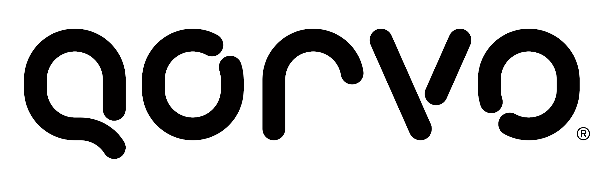

[![OpenThread][ot-logo]][ot-repo]

[![Build-gcc][ot-build-gcc-svg]][ot-build-gcc]
[![Build-arm-gcc][ot-build-arm-gcc-svg]][ot-build-arm-gcc]
[![Build-clang][ot-build-clang-svg]][ot-build-clang]
[![Build-macos][ot-build-macos-svg]][ot-build-macos]
[![Build-misc][ot-build-svg]][ot-build]
[![Simulation-cli][ot-simulation-cli-svg]][ot-simulation-cli]
[![Simulation-ncp][ot-simulation-ncp-svg]][ot-simulation-ncp]
[![Simulation-distcheck][ot-simulation-distcheck-svg]][ot-simulation-distcheck]
[![Simulation-otns][ot-simulation-otns-svg]][ot-simulation-otns]
[![Simulation 1.2][ot-simulation-1p2-svg]][ot-simulation-1p2]
[![POSIX][ot-posix-svg]][ot-posix]
[![Toranj][ot-toranj-svg]][ot-toranj]
[![Docker][ot-docker-svg]][ot-docker]
[![Language grade: C/C++][ot-lgtm-svg]][ot-lgtm]
[![Coverage Status][ot-codecov-svg]][ot-codecov]

---

# What is OpenThread?

OpenThread released by Google is... 

**...an open-source implementation of the [Thread](http://threadgroup.org/technology/ourtechnology) networking protocol.** Google Nest has released OpenThread to make the technology used in Nest products more broadly available to developers to accelerate the development of products for the connected home.

**...OS and platform agnostic**, with a narrow platform abstraction layer and a small memory footprint, making it highly portable. It supports both system-on-chip (SoC) and network co-processor (NCP) designs.

**...a Thread Certified Component**, implementing all features defined in the [Thread 1.1.1 specification](http://threadgroup.org/technology/ourtechnology#specifications), including all Thread networking layers (IPv6, 6LoWPAN, IEEE 802.15.4 with MAC security, Mesh Link Establishment, Mesh Routing) and device roles, as well as [Border Router](https://github.com/openthread/ot-br-posix) support.

More information about Thread can be found at [threadgroup.org](http://threadgroup.org/). Thread is a registered trademark of the Thread Group, Inc.

[thread]: http://threadgroup.org/technology/ourtechnology
[ot-repo]: https://github.com/openthread/openthread
[ot-logo]: doc/images/openthread_logo.png
[ot-build-gcc]: https://github.com/openthread/openthread/actions?query=branch%3Amaster+event%3Apush+workflow%3A%22Build+%28gcc%29%22
[ot-build-gcc-svg]: https://github.com/openthread/openthread/workflows/Build%20(gcc)/badge.svg?branch=master&event=push
[ot-build-arm-gcc]: https://github.com/openthread/openthread/actions?query=branch%3Amaster+event%3Apush+workflow%3A%22Build+%28arm-gcc%29%22
[ot-build-arm-gcc-svg]: https://github.com/openthread/openthread/workflows/Build%20(arm-gcc)/badge.svg?branch=master&event=push
[ot-build-clang]: https://github.com/openthread/openthread/actions?query=branch%3Amaster+event%3Apush+workflow%3A%22Build+%28clang%29%22
[ot-build-clang-svg]: https://github.com/openthread/openthread/workflows/Build%20(clang)/badge.svg?branch=master&event=push
[ot-build-macos]: https://github.com/openthread/openthread/actions?query=branch%3Amaster+event%3Apush+workflow%3A%22Build+%28macos%29%22
[ot-build-macos-svg]: https://github.com/openthread/openthread/workflows/Build%20(macos)/badge.svg?branch=master&event=push
[ot-build]: https://github.com/openthread/openthread/actions?query=workflow%3ABuild+branch%3Amaster+event%3Apush
[ot-build-svg]: https://github.com/openthread/openthread/workflows/Build/badge.svg?branch=master&event=push
[ot-simulation-cli]: https://github.com/openthread/openthread/actions?query=workflow%3A%22Simulation+%28cli%29%22+branch%3Amaster+event%3Apush
[ot-simulation-cli-svg]: https://github.com/openthread/openthread/workflows/Simulation%20(cli)/badge.svg?branch=master&event=push
[ot-simulation-ncp]: https://github.com/openthread/openthread/actions?query=workflow%3A%22Simulation+%28ncp%29%22+branch%3Amaster+event%3Apush
[ot-simulation-ncp-svg]: https://github.com/openthread/openthread/workflows/Simulation%20(ncp)/badge.svg?branch=master&event=push
[ot-simulation-distcheck]: https://github.com/openthread/openthread/actions?query=workflow%3A%22Simulation+%28distcheck%29%22+branch%3Amaster+event%3Apush
[ot-simulation-distcheck-svg]: https://github.com/openthread/openthread/workflows/Simulation%20(distcheck)/badge.svg?branch=master&event=push
[ot-simulation-otns]: https://github.com/openthread/openthread/actions?query=workflow%3A%22Simulation+%28otns%29%22+branch%3Amaster+event%3Apush
[ot-simulation-otns-svg]: https://github.com/openthread/openthread/workflows/Simulation%20(otns)/badge.svg?branch=master&event=push
[ot-simulation-1p2]: https://github.com/openthread/openthread/actions?query=workflow%3A%22Simulation+1.2%22+branch%3Amaster+event%3Apush
[ot-simulation-1p2-svg]: https://github.com/openthread/openthread/workflows/Simulation%201.2/badge.svg?branch=master&event=push
[ot-posix]: https://github.com/openthread/openthread/actions?query=workflow%3APOSIX+branch%3Amaster+event%3Apush
[ot-posix-svg]: https://github.com/openthread/openthread/workflows/POSIX/badge.svg?branch=master&event=push
[ot-toranj]: https://github.com/openthread/openthread/actions?query=workflow%3AToranj+branch%3Amaster+event%3Apush
[ot-toranj-svg]: https://github.com/openthread/openthread/workflows/Toranj/badge.svg?branch=master&event=push
[ot-docker]: https://github.com/openthread/openthread/actions?query=workflow%3ADocker+branch%3Amaster+event%3Apush
[ot-docker-svg]: https://github.com/openthread/openthread/workflows/Docker/badge.svg?branch=master&event=push
[ot-lgtm]: https://lgtm.com/projects/g/openthread/openthread/context:cpp
[ot-lgtm-svg]: https://img.shields.io/lgtm/grade/cpp/g/openthread/openthread.svg?logo=lgtm&logoWidth=18
[ot-codecov]: https://codecov.io/gh/openthread/openthread
[ot-codecov-svg]: https://codecov.io/gh/openthread/openthread/branch/master/graph/badge.svg

# Who supports OpenThread?

# Getting started

All end-user documentation and guides are located at [openthread.io](https://openthread.io). If you're looking to do things like...

- Learn more about OpenThread features and enhancements
- Use OpenThread in your products
- Learn how to build and configure a Thread network
- Port OpenThread to a new platform
- Build an application on top of OpenThread
- Certify a product using OpenThread

...then [openthread.io](https://openthread.io) is the place for you.

> Note: For users in China, end-user documentation is available at [openthread.google.cn](https://openthread.google.cn).

If you're interested in contributing to OpenThread, read on.

# Contributing

We would love for you to contribute to OpenThread and help make it even better than it is today! See our [Contributing Guidelines](https://github.com/openthread/openthread/blob/master/CONTRIBUTING.md) for more information.

Contributors are required to abide by our [Code of Conduct](https://github.com/openthread/openthread/blob/master/CODE_OF_CONDUCT.md) and [Coding Conventions and Style Guide](https://github.com/openthread/openthread/blob/master/STYLE_GUIDE.md).

# Versioning

OpenThread follows the [Semantic Versioning guidelines](http://semver.org/) for release cycle transparency and to maintain backwards compatibility. OpenThread's versioning is independent of the Thread protocol specification version but will clearly indicate which version of the specification it currently supports.

# License

OpenThread is released under the [BSD 3-Clause license](https://github.com/openthread/openthread/blob/master/LICENSE). See the [`LICENSE`](https://github.com/openthread/openthread/blob/master/LICENSE) file for more information.

Please only use the OpenThread name and marks when accurately referencing this software distribution. Do not use the marks in a way that suggests you are endorsed by or otherwise affiliated with Nest, Google, or The Thread Group.

# Need help?

There are numerous avenues for OpenThread support:

- Bugs and feature requests — [submit to the Issue Tracker](https://github.com/openthread/openthread/issues)
- Stack Overflow — [post questions using the `openthread` tag](http://stackoverflow.com/questions/tagged/openthread)
- Google Groups — [discussion and announcements at openthread-users](https://groups.google.com/forum/#!forum/openthread-users)

The openthread-users Google Group is the recommended place for users to discuss OpenThread and interact directly with the OpenThread team.
