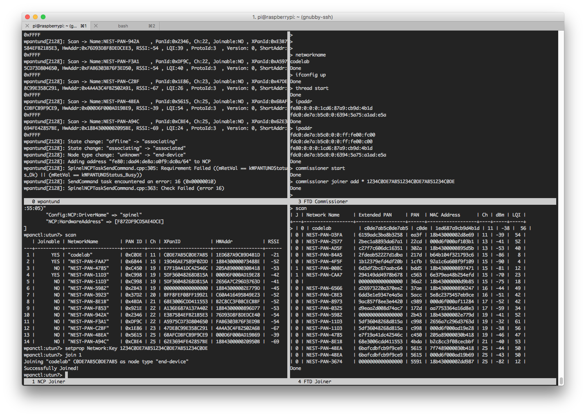

/*
 *  Copyright (c) 2021, The OpenThread Authors.
 *  All rights reserved.
 *
 *  Redistribution and use in source and binary forms, with or without
 *  modification, are permitted provided that the following conditions are met:
 *  1. Redistributions of source code must retain the above copyright
 *     notice, this list of conditions and the following disclaimer.
 *  2. Redistributions in binary form must reproduce the above copyright
 *     notice, this list of conditions and the following disclaimer in the
 *     documentation and/or other materials provided with the distribution.
 *  3. Neither the name of the copyright holder nor the
 *     names of its contributors may be used to endorse or promote products
 *     derived from this software without specific prior written permission.
 *
 *  THIS SOFTWARE IS PROVIDED BY THE COPYRIGHT HOLDERS AND CONTRIBUTORS "AS IS"
 *  AND ANY EXPRESS OR IMPLIED WARRANTIES, INCLUDING, BUT NOT LIMITED TO, THE
 *  IMPLIED WARRANTIES OF MERCHANTABILITY AND FITNESS FOR A PARTICULAR PURPOSE
 *  ARE DISCLAIMED. IN NO EVENT SHALL THE COPYRIGHT HOLDER OR CONTRIBUTORS BE
 *  LIABLE FOR ANY DIRECT, INDIRECT, INCIDENTAL, SPECIAL, EXEMPLARY, OR
 *  CONSEQUENTIAL DAMAGES (INCLUDING, BUT NOT LIMITED TO, PROCUREMENT OF
 *  SUBSTITUTE GOODS OR SERVICES; LOSS OF USE, DATA, OR PROFITS; OR BUSINESS
 *  INTERRUPTION) HOWEVER CAUSED AND ON ANY THEORY OF LIABILITY, WHETHER IN
 *  CONTRACT, STRICT LIABILITY, OR TORT (INCLUDING NEGLIGENCE OR OTHERWISE)
 *  ARISING IN ANY WAY OUT OF THE USE OF THIS SOFTWARE, EVEN IF ADVISED OF THE
 *  POSSIBILITY OF SUCH DAMAGE.
 */
 
---
id: openthread-hardware
summary: In this Codelab, you'll program OpenThread on real hardware, create and manage a Thread network, and pass messages between nodes.
status: [final]
authors: Jeff Bumgardner
categories: Nest
tags: web
feedback link: https://github.com/openthread/openthread/issues

---

{# <!--* freshness: { owner: 'jbumgardner' reviewed: '2020-12-01' } *--> #}

# Build a Thread network with nRF52840 boards and OpenThread

[Codelab Feedback](https://github.com/openthread/openthread/issues)


## Introduction


[OpenThread](https://openthread.io) released by Google is an open-source
implementation of the  [Thread®](http://threadgroup.org/) networking protocol.
Google Nest has released OpenThread to make the technology used in Nest products
broadly available to developers to accelerate the development of products for
the connected home.

The  [Thread specification](http://threadgroup.org/ThreadSpec) defines an
IPv6-based reliable, secure and low-power wireless device-to-device
communication protocol for home applications. OpenThread implements all Thread
networking layers including IPv6, 6LoWPAN, IEEE 802.15.4 with MAC security, Mesh
Link Establishment, and Mesh Routing.

In this Codelab, you'll program OpenThread on real hardware, create and manage a
Thread network, and pass messages between nodes.


### What you'll learn

* Building and flashing OpenThread CLI binaries to dev boards
* Building an RCP consisting of a Linux machine and a dev board
* Communicating with an RCP using OpenThread Daemon and `ot-ctl`
* Manually managing Thread nodes with Screen and the OpenThread CLI
* Secure commissioning of devices onto a Thread network
* How IPv6 multicast works
* Passing messages between Thread nodes with UDP

### What you'll need

Hardware:

* 3 Nordic Semiconductor nRF52840 dev boards
* 3 USB to Micro-USB cables to connect the boards
* A Linux machine with at least 3 USB ports

Software:

* GNU Toolchain
* Nordic nRF5x command line tools
* Segger J-Link software
* OpenThread
* Git

*Except as otherwise noted, the content of this Codelab is licensed under the
[Creative Commons Attribution 3.0 License](https://creativecommons.org/licenses/by/3.0/),
and code samples are licensed under the
[Apache 2.0 License](https://www.apache.org/licenses/LICENSE-2.0).*


## Getting started
Duration: 10:00


### OpenThread Simulation

Before beginning, you might want to run through the
[OpenThread Simulation Codelab](https://codelabs.developers.google.com/codelabs/openthread-simulation/#0),
to get familiar with basic Thread concepts and the OpenThread CLI.

### Serial port terminals

You should be familiar with how to connect to a serial port through a terminal.
This Codelab uses Screen and provides a usage overview, but any other terminal
software can be used.

### Linux machine

This Codelab was designed to use an i386- or x86-based Linux machine to serve as
the host to a Radio Co-Processor (RCP) Thread device, and to flash all Thread
development boards. All steps were tested on Ubuntu 14.04.5 LTS (Trusty Tahr).

### Nordic Semiconductor nRF52840 boards

This Codelab uses three
[nRF52840 PDK boards](https://www.nordicsemi.com/eng/Products/nRF52840-Preview-DK).


> aside positive
>
> **Important:** Make sure the boards have sufficient power. Don't use a USB
port splitter to connect them to the Linux machine, and turn off any sleep
functionality for the Linux machine. Boards with insufficient power may behave
erratically.

### Install SEGGER J-Link

We use SEGGER J-Link to program the nRF52840 boards, which have onboard
JTAG modules. Install this on your Linux machine.

<button>[Download J-Link Software and Documentation Pack](https://www.segger.com/downloads/jlink/#J-LinkSoftwareAndDocumentationPack)</button>

Download the appropriate package for your machine, and install it in the proper
location. On Linux this is `/opt/SEGGER/JLink`.

### Install nRF5x Command Line Tools

The nRF5x Command Line Tools allow you to flash the OpenThread binaries to the
nRF52840 boards. Install the appropriate nRF5x-Command-Line-Tools-&lt;OS&gt;
build on your Linux machine.

<button>[Download nRF5x Command Line Tools](https://www.nordicsemi.com/DocLib/Content/User_Guides/getting_started/latest/UG/common/nordic_tools)</button>

Place the extracted package in the root folder `~/`

> aside positive
>
> **Note:** The nRF5x Command Line Tools do not support ARM architectures;
therefore, the nRF52840 boards cannot be flashed by ARM-based Linux machines,
such as the Raspberry Pi 3B.

### Install ARM GNU Toolchain

The ARM GNU Toolchain is used for building.

<button>[Download ARM GNU Toolchain portable archive](https://developer.arm.com/open-source/gnu-toolchain/gnu-rm/downloads)</button>

We recommend placing the extracted archive in
`/opt/gnu-mcu-eclipse/arm-none-eabi-gcc/` on your Linux machine.
Follow the instructions in the archive's `readme.txt` file for installation
instructions.

### Install Screen (optional)

Screen is a simple tool for accessing devices connected by a serial port. This
Codelab uses Screen, but you may use any serial port terminal application you
wish.

```console
$ sudo apt-get install screen
```


## Clone repositories
Duration: 07:00


### OpenThread

Clone and install OpenThread. The `script/bootstrap` commands make sure the toolchain
is installed and the environment is properly configured:

```console
$ mkdir -p ~/src
$ cd ~/src
$ git clone --recursive https://github.com/openthread/openthread.git
$ cd openthread
$ ./script/bootstrap
```

Build OpenThread Daemon:

```console
$ script/cmake-build posix -DOT_DAEMON=ON
```

Now you're ready to build and flash OpenThread to the nRF52840 boards.


## Set up the RCP Joiner
Duration: 10:00


### Build and flash

Build the OpenThread nRF52840 example with Joiner and native USB functionality.
A device uses the Joiner role to be securely authenticated and commissioned onto
a Thread network. Native USB enables the use of USB CDC ACM as a serial
transport between the nRF52840 and the host.

Always clean the repo of previous builds first by running `rm -rf build`.

```console
$ cd ~/src
$ git clone --recursive https://github.com/openthread/ot-nrf528xx.git
$ cd ot-nrf528xx
$ script/build nrf52840 USB_trans
```

> aside positive
>
> For more information on building and configuring OpenThread, see
[Build OpenThread](https://openthread.io/guides/build/).

Navigate to the directory with the OpenThread RCP binary, and convert it to
hex format:

```console
$ cd ~/src/ot-nrf528xx/build/bin
$ arm-none-eabi-objcopy -O ihex ot-rcp ot-rcp.hex
```

Attach the USB cable to the Micro-USB debug port next to the external power pin
on the nRF52840 board, and then plug it into the Linux machine. Set the
**nRF power source** switch on the nRF52840 board to **VDD**. When connected
correctly, **LED5** is on.


If this is the first board attached to the Linux machine, it appears as
serial port `/dev/ttyACM0` (all nRF52840 boards use `ttyACM` for the serial port
identifier).

```console
$ ls /dev/ttyACM*
/dev/ttyACM0
```

Note the serial number of the nRF52840 board being used for the RCP:


Navigate to the location of the nRFx Command Line Tools, and flash the
OpenThread RCP hex file onto the nRF52840 board, using the board's serial
number:

```console
$ cd ~/nrfjprog/
$ ./nrfjprog -f nrf52 -s 683704924 --chiperase --program \
       ~/src/ot-nrf528xx/build/bin/ot-rcp.hex --reset
```

The following output is generated upon success:

```console
Parsing hex file.
Erasing user available code and UICR flash areas.
Applying system reset.
Checking that the area to write is not protected.
Programing device.
Applying system reset.
Run.
```

Label the board "RCP" so that later you don't confuse the board roles.

### Connect to native USB

Because the OpenThread RCP build enables use of native USB CDC ACM as a serial
transport, you must use the **nRF USB** port on the nRF52840 board to
communicate with the RCP host (Linux machine).

Detach the Micro-USB end of the USB cable from the debug port of the flashed
nRF52840 board, then reattach it to the Micro-USB **nRF USB** port next to the
**RESET** button. Set the **nRF power source** switch to **USB**.


> aside positive
>
> **Note:** When the nRF52840 board is properly connected to a host via the nRF
USB port, none of the LED indicators light up, even though the board is
operational.

### Start OpenThread Daemon

In the RCP design, use OpenThread Daemon to communicate with and manage the
Thread device.  Start `ot-daemon` with the `-v` verbose flag so you can see log
output and confirm that it is running:

```console
$ cd ~/src/openthread
$ ./build/posix/src/posix/ot-daemon -v \
    'spinel+hdlc+uart:///dev/ttyACM0?uart-baudrate=115200'
```

When successful, `ot-daemon` in verbose mode generates output similar to the
following:

```console
ot-daemon[228024]: Running OPENTHREAD/20191113-00831-gfb399104; POSIX; Jun  7 2020 18:05:15
ot-daemon[228024]: Thread version: 2
ot-daemon[228024]: RCP version: OPENTHREAD/20191113-00831-gfb399104; SIMULATION; Jun  7 2020 18:06:08
```

Leave this terminal window open so that logs from `ot-daemon` can be viewed.

Use `ot-ctl` to communicate with the RCP node. `ot-ctl` uses the same CLI as the
OpenThread CLI app. Therefore, you can control `ot-daemon` nodes in the same
manner as the other simulated Thread devices.

In a second terminal window, start `ot-ctl`:

```console
$ ./output/posix/bin/ot-ctl
>
```

Check the `state` of Node 2 (the RCP node) you started with `ot-daemon`:

```console
> state
disabled
Done
```


## Set up the FTDs
Duration: 15:00


The other two Thread nodes used in this Codelab are Full Thread Devices (FTDs)
on the standard System-on-Chip (SoC) design. They do not use `wpantund`, and the
user manually manages them with the OpenThread CLI.

One device functions as the Commissioner, to securely authenticate and
commission devices onto that network. The other device functions as a Joiner
that the Commissioner can authenticate to the Thread network.

### Build and flash

Build the OpenThread FTD example for the nRF52840 platform, with the
Commissioner and Joiner roles enabled:

```console
$ cd ~/src/ot-nrf528xx
$ rm -rf build
$ script/build nrf52840 UART_trans -DOT_JOINER=ON -DOT_COMMISSIONER=ON
```

> aside positive
>
> Ideally, you should build OpenThread with only the desired functionality
enabled. For example, the FTD Joiner would only use the `JOINER=1` switch. For
ease of use in this Codelab, build a single image with both roles so that the
image can be used for both FTDs.

Navigate to the directory with the OpenThread Full Thread Device (FTD) CLI
binary, and convert it to hex format:

```console
$ cd ~/src/ot-nrf528xx/build/bin
$ arm-none-eabi-objcopy -O ihex ot-cli-ftd ot-cli-ftd.hex
```

Attach the USB cable to the Micro-USB port next to the external power pin on the
nRF52840 board, and then plug it into the Linux machine. If the RCP is still
attached to the Linux machine, this new board should appear as serial port
`/dev/ttyACM1` (all nRF52840 boards use `ttyACM` for the serial port identifier).

```console
$ ls /dev/ttyACM*
/dev/ttyACM0  /dev/ttyACM1
```

As before, note the serial number of the nRF52840 board being used for the FTD:


Navigate to the location of the nRFx Command Line Tools, and flash the
OpenThread CLI FTD hex file onto the nRF52840 board, using the board's serial
number:

```console
$ cd ~/nrfjprog/
$ ./nrfjprog -f nrf52 -s 683704924 --chiperase --program \
       ~/src/ot-nrf528xx/build/bin/ot-cli-ftd.hex --reset
```

Label the board "Commissioner."

### Verify build

Verify a successful build by accessing the OpenThread CLI using GNU Screen from
a terminal window. The nRF52840 boards use a baud rate of 115200.

```console
$ screen /dev/ttyACM1 115200
```

In the new window, press Return on the keyboard a few times to bring up the
OpenThread CLI `&gt;` prompt. Bring up the IPv6 interface and check for
addresses:

```console
> ifconfig up
Done
> ipaddr
fe80:0:0:0:1cd6:87a9:cb9d:4b1d
Done
```

**Use Ctrl+a →** **`d`** **to detach from the FTD Commissioner CLI** screen and
return to the Linux terminal so that the next board can be flashed. To re-enter
the CLI at any time, use `screen -r` from the command line. To see a list of
available screens, use `screen -ls`:

```console
$ screen -ls
There is a screen on:
        74182.ttys000.mylinuxmachine        (Detached)
1 Socket in /tmp/uscreens/S-username.
```

### Set up the FTD Joiner

Repeat the above process to flash the third nRF52840 board, using the existing
`ot-cli-ftd.hex` build.

If the other two nodes are attached to the Linux machine when this third board
is attached, it should appear as serial port `/dev/ttyACM2`:

```console
$ ls /dev/ttyACM*
/dev/ttyACM0  /dev/ttyACM1  /dev/ttyACM2
```

Label the board "Joiner."

When verifying using Screen, instead of creating a new instance of Screen from
the command line, reattach to the existing one and make a new window within it
(that you used for the FTD Commissioner):

```console
$ screen -r
```

**Create the new window within Screen with Ctrl+a →** **`c`****.** A new command
line prompt appears. Access the OpenThread CLI for the FTD Joiner:

```console
$ screen /dev/ttyACM2 115200
```

In this new window, press Return on the keyboard a few times to bring up the
OpenThread CLI `&gt;` prompt. Bring up the IPv6 interface and check for
addresses:

```console
> ifconfig up
Done
> ipaddr
fe80:0:0:0:6c1e:87a2:df05:c240
Done
```

Now that the FTD Joiner CLI is in the same instance of Screen as the FTD
Commissioner, you can switch between them using Ctrl+a → `n`.

**Use Ctrl+a →** **`d`** **at any time to exit Screen.**


## Terminal window setup
Duration: 05:00


Going forward, you will be switching between Thread devices frequently, so make
sure all of them are live and easily accessible. So far, we have been using
Screen to access the two FTDs, and this tool also allows split screen on the
same terminal window. Use this to see how one node reacts to commands issued
on another.

Ideally, you should have four windows readily available:

1. **`ot-daemon`** service / logs
2. **RCP Joiner** via `ot-ctl`
3. **FTD Commissioner** via OpenThread CLI
4. **FTD Joiner** via OpenThread CLI

If you wish to use your own terminal / serial port configuration or tool, feel
free to skip to the next step. Configure the terminal windows for all devices in
the way that works best for you.

### Using Screen

For ease of use, only start one Screen session. You should already have one from
when you set up both FTDs.

**All commands within Screen start with Ctrl+a.**

Basic Screen commands:

| Reattach to the Screen session (from the command line) | <code>screen -r</code> |
| --- | --- |
| Leave the Screen session | Ctrl+a → <code>d</code> |
| Create new window within the Screen session | Ctrl+a → <code>c</code> |
| Switch between windows in the same Screen session | Ctrl+a → <code>n</code> (forward)Ctrl+a → <code>p</code> (back) |
| Kill the current window in the Screen session | Ctrl+a → <code>k</code> |

> aside negative
>
> If you ever get lost in your configuration, keep killing Screen windows with
Ctrl+a → `k` until none exist. Then start a new Screen session and create new
windows for each device.

### Split Screen

With Screen, you can split the terminal into multiple windows:



Commands in `screen` are accessed by using Ctrl+a. Every command should start
with this access key combo.

If you've been following the Codelab exactly, you should have two windows
(FTD Commissioner, FTD Joiner) on the same Screen instance. To split the screen
between the two, first enter your existing Screen session:

```console
$ screen -r
```

You should be on one of the FTD devices. Follow these steps in Screen:

1. Ctrl+a → `S` to split the window horizontally
2. Ctrl+a → `Tab` to move the cursor to the new blank window
3. Ctrl+a → `n` to switch that new window to the next one
4. If it's the same as the top window, Ctrl+a → `n` again to view the other FTD device

They are now both visible. Switch between them using Ctrl+a → `Tab`. It's
recommend you retitle each window with Ctrl+a → `A` to avoid confusion.

### Advanced use

To further split the screen into quadrants and view the `ot-daemon` logs and the
RCP Joiner `ot-ctl`, those services must be started within this same Screen
instance. To do so, stop `ot-daemon` and exit `ot-ctl`, and restart them within
new Screen windows (Ctrl+a → `c`).

This setup is not required and is left as an exercise for the user.

Split and navigate between windows with the following commands:

| Create new window | Ctrl+a → <code>c</code> |
| --- | --- |
| Split window vertically | Ctrl+a → <code>|</code> |
| Split window horizontally | Ctrl+a → <code>S</code> |
| Jump to the next displayed window | Ctrl+a → <code>Tab</code> |
| Switch the displayed window forward or back | Ctrl+a → <code>n</code> or <code>p</code> |
| Rename the current window | Ctrl+a → <code>A</code> |

Leave Screen at any time with Ctrl+a → `d` and reattach with `screen -r` from
the command line.

> aside positive
>
> **Note**: If you detach from your Screen session, the split window configuration is not saved.

For more information on Screen, see the
[GNU Screen quick reference](http://aperiodic.net/screen/quick_reference).


## Create the Thread network
Duration: 05:00


> aside negative
>
> **Important:** Identifying information on your Thread nodes—such as IPv6
addresses, RLOC16s, and MAC addresses—will differ from those in the example
output in this Codelab.

Now that you have all your terminal windows and screens configured, let's create
our Thread network. On the **FTD Commissioner**, create a new Operational
Dataset and commit it as the active one. The Operational Dataset is the
configuration for the Thread network you are creating.

> aside positive
>
> `dataset init new` creates a new Operational Dataset with random values.
**Your values will differ from the values shown in this Codelab.**
Replace the values in the Codelab example commands with the values from your
Operational Dataset.

```console
## FTD Commissioner ##
----------------------

> dataset init new
Done
> dataset
Active Timestamp: 1
Channel: 11
Channel Mask: 07fff800
Ext PAN ID: c0de7ab5c0de7ab5
Mesh Local Prefix: fdc0:de7a:b5c0/64
Master Key: 1234c0de7ab51234c0de7ab51234c0de
Network Name: OpenThread-c0de
PAN ID: 0xc0de
PSKc: ebb4f2f8a68026fc55bcf3d7be3e6fe4
Security Policy: 0, onrcb
Done
```

Make note of the Master Key `1234c0de7ab51234c0de7ab51234c0de` which will be
used later.

Commit this dataset as the active one:

```console
> dataset commit active
Done
```

Bring up the IPv6 interface:

```console
> ifconfig up
Done
```

Start Thread protocol operation:

```console
> thread start
Done
```

After a moment, check the device state. It should be the Leader. Also get the
RLOC16 for future reference.

```console
## FTD Commissioner ##
----------------------

> state
leader
Done
> rloc16
0c00
Done
```

Check the device's IPv6 addresses:

```console
## FTD Commissioner ##
----------------------

> ipaddr
fdc0:de7a:b5c0:0:0:ff:fe00:fc00        # Leader Anycast Locator (ALOC)
fdc0:de7a:b5c0:0:0:ff:fe00:c00         # Routing Locator (RLOC)
fdc0:de7a:b5c0:0:6394:5a75:a1ad:e5a    # Mesh-Local EID (ML-EID)
fe80:0:0:0:1cd6:87a9:cb9d:4b1d         # Link-Local Address (LLA)
```

> aside positive
>
> A single Thread node has multiple IPv6 addresses. For more information, see
[IPv6 Addressing](https://openthread.io/guides/thread-primer/ipv6-addressing#unicast_address_types).

The "codelab" network is now visible when scanned from other Thread devices.

From `ot-ctl` on the **RCP Joiner**:

```console
## RCP Joiner ##
----------------

> scan
| J | Network Name     | Extended PAN     | PAN  | MAC Address      | Ch | dBm | LQI |
+---+------------------+------------------+------+------------------+----+-----+-----+
| 0 | OpenThread-c0de  | c0de7ab5c0de7ab5 | c0de | 1ed687a9cb9d4b1d | 11 | -36 | 232 |
```

From the OpenThread CLI on the **FTD Joiner**:

```console
## FTD Joiner ##
----------------

> scan
| J | Network Name     | Extended PAN     | PAN  | MAC Address      | Ch | dBm | LQI |
+---+------------------+------------------+------+------------------+----+-----+-----+
| 0 | OpenThread-c0de  | c0de7ab5c0de7ab5 | c0de | 1ed687a9cb9d4b1d | 11 | -38 | 229 |
```

If the "codelab" network doesn't appear in the list, try scanning again.

You may note that in both scans, the network seems to be not joinable
(*J* column on the RCP Joiner and FTD Joiner). This only
means that Thread Commissioning is not active on the network. It can still be
joined out-of-band, by entering the network master key in the joiner device
manually.

> aside positive
>
> In-band commissioning is when network credentials are transferred to the
joiner over the radio. Out-of-band commissioning is when they are given to the
joiner by other means (for example, manual entry in the OpenThread CLI).


## Add the RCP Joiner
Duration: 05:00


Let's add the RCP Joiner to the Thread network we just created, using an
out-of-band process. Scan for networks on the **RCP Joiner**:

```console
## RCP Joiner ##
----------------

> scan
| J | Network Name     | Extended PAN     | PAN  | MAC Address      | Ch | dBm | LQI |
+---+------------------+------------------+------+------------------+----+-----+-----+
| 0 | OpenThread-c0de  | c0de7ab5c0de7ab5 | c0de | 1ed687a9cb9d4b1d | 11 | -38 | 229 |
```

To join, set the network master key (we just obtained from the FTD commissioner)
on the RCP Joiner in its active dataset.
```console
## RCP Joiner ##
----------------

> dataset masterkey 1234c0de7ab51234c0de7ab51234c0de
Done
> dataset commit active
Done
```

Check the dataset to ensure that it's set correctly.

```console
## RCP Joiner ##
----------------

> dataset
Master Key: 1234c0de7ab51234c0de7ab51234c0de
```

Bring up Thread so the RCP Joiner joins the "codelab" network. Wait a few
seconds, check the state, RLOC16 and its IPv6 addresses:

```console
## RCP Joiner ##
----------------

> thread start
Done
> state
child
Done
> rloc16
0c01
Done
> ipaddr
fdc0:de7a:b5c0:0:0:ff:fe00:0c01         # Routing Locator (RLOC)
fdc0:de7a:b5c0:0:66bf:99b9:24c0:d55f    # Mesh-Local EID (ML-EID)
fe80:0:0:0:18e5:29b3:a638:943b          # Link-Local Address (LLA)
Done
```

Make note of the Mesh-Local IPv6 Address (`fdc0:de7a:b5c0:0:66bf:99b9:24c0:d55f` here),
you'll use it later.

Back on the **FTD Commissioner**, check the router and child tables to confirm
both devices are part of the same network. Use the RLOC16 to identify the RCP
Joiner.

```console
## FTD Commissioner ##
----------------------

> router table
| ID | RLOC16 | Next Hop | Path Cost | LQ In | LQ Out | Age | Extended MAC     |
+----+--------+----------+-----------+-------+--------+-----+------------------+
|  3 | 0x0c00 |        3 |         0 |     0 |      0 |  35 | 1ed687a9cb9d4b1d |

Done
> child table
| ID  | RLOC16 | Timeout    | Age        | LQ In | C_VN |R|S|D|VER| Extended MAC     |
+-----+--------+------------+------------+-------+------+-+-+-+---+------------------+
|   1 | 0x0c01 |        240 |         25 |     3 |   89 |1|1|1|  2| 1ae529b3a638943b |
Done
```

Ping the mesh-local address of the RCP Joiner (the Mesh-Local address obtained from
the RCP Joiner's `ipaddr` output) to verify connectivity:

```console
## FTD Commissioner ##
----------------------

> ping fdc0:de7a:b5c0:0:66bf:99b9:24c0:d55f
> 8 bytes from fdc0:de7a:b5c0:0:66bf:99b9:24c0:d55f: icmp_seq=1 hlim=64 time=40ms
```

We now have a Thread network consisting of two nodes, illustrated by this
topology diagram:


### Topology diagrams

As you work through the rest of the Codelab, we'll show a new Thread topology
diagram whenever the state of the network changes. Node roles are denoted as
follows:


Routers are always pentagons, and End Devices are always circles. The numbers on
each node represent the Router ID or Child ID shown in the CLI output, depending
on each node's current role and state at that time.


## Commission the FTD Joiner
Duration: 07:00


Now let's add the third Thread device to the "codelab" network. This time we're
going to use the more secure in-band commissioning process. On the
**FTD Joiner**, scan for the network:

```console
## FTD Joiner ##
----------------

> scan
| J | Network Name     | Extended PAN     | PAN  | MAC Address      | Ch | dBm | LQI |
+---+------------------+------------------+------+------------------+----+-----+-----+
| 0 | OpenThread-c0de  | c0de7ab5c0de7ab5 | c0de | f65ae2853ff0c4e4 | 11 | -36 |  57 |
```

A `0` in the J column indicates that Thread Commissioning is not active on the
device.

Let's be specific when commissioning on this next device, and only allow the
FTD Joiner to join. Still on the FTD Joiner, get the `eui64`, so the FTD
Commissioner can identify it:

```console
## FTD Joiner ##
----------------

> eui64
2f57d222545271f1
Done
```

On the **FTD Commissioner**, start the commissioner and specify the `eui64` of
the device that can join, along with the Joiner Credential. The Joiner
Credential is a device-specific passphrase.

```console
## FTD Commissioner ##
----------------------

> commissioner start
Done
> commissioner joiner add 2f57d222545271f1 J01NME
Done
```

> aside negative
>
> **Warning:** If you get an error when run the `commissioner joiner` command,
stop and restart the commissioner role with `commissioner stop` and
`commissioner start`, then try the `commissioner joiner` command again.

Switch to the **FTD Joiner**, and rescan:

```console
## FTD Joiner ##
----------------

> scan
| J | Network Name     | Extended PAN     | PAN  | MAC Address      | Ch | dBm | LQI |
+---+------------------+------------------+------+------------------+----+-----+-----+
| 1 | OpenThread-c0de  | c0de7ab5c0de7ab5 | c0de | 1ed687a9cb9d4b1d | 11 | -45 | 196 |
```

As indicated by the `1` in the J column, Thread Commissioning is now active on
the network. Start the joiner role with the Joiner Credential you just set up on
the FTD Commissioner:

```console
## FTD Joiner ##
----------------

> ifconfig up
Done
> joiner start J01NME
Done
```

Within a minute or so, you get a confirmation of a successful authentication:

```console
## FTD Joiner ##
----------------

>
Join success
```

> aside negative
>
> **Warning:** If you wait too long (more than a few minutes) to start the
joiner role on the FTD Joiner, the commissioner may time out and the join fail.
Stop and restart the commissioner and try it again.

Bring up Thread so the FTD Joiner joins the "codelab" network, and immediately
check the state and RLOC16:

```console
## FTD Joiner ##
----------------

> thread start
Done
> state
child
Done
> rloc16
0c02
Done
```

Check the device's IPv6 addresses. Notice that there is no ALOC. That's because
this device is not the Leader, nor does it hold an Anycast-specific role that
requires an ALOC.

```console
## FTD Joiner ##
----------------

> ipaddr
fdc0:de7a:b5c0:0:0:ff:fe00:c02         # Routing Locator (RLOC)
fdc0:de7a:b5c0:0:3e2e:66e:9d41:ebcd    # Mesh-Local EID (ML-EID)
fe80:0:0:0:e4cd:d2d9:3249:a243         # Link-Local Address (LLA)
```

Immediately switch to the **FTD Commissioner** and check the router and child
tables to confirm that three devices exist in the "codelab" network:

```console
## FTD Commissioner ##
----------------------

> router table
| ID | RLOC16 | Next Hop | Path Cost | LQ In | LQ Out | Age | Extended MAC     |
+----+--------+----------+-----------+-------+--------+-----+------------------+
|  3 | 0x0c00 |        3 |         0 |     0 |      0 |  50 | 1ed687a9cb9d4b1d |

> child table
| ID  | RLOC16 | Timeout    | Age        | LQ In | C_VN |R|S|D|N| Extended MAC     |
+-----+--------+------------+------------+-------+------+-+-+-+-+------------------+
|   1 | 0x0c01 |        240 |         25 |     3 |   89 |1|1|1|1| 1ae529b3a638943b |
|   2 | 0x0c02 |        240 |         15 |     3 |   44 |1|1|1|1| e6cdd2d93249a243 |
Done
```

> aside negative
>
> **Important:** It's possible that by the time you check the router and child
tables, you see two Routers and one End Device (child). If so, don't worry! You
did nothing wrong. Continue on to learn why this happened.

Based on the RLOC16, the FTD Joiner has attached to the network as an End Device
(child). Here is our updated topology:


## Thread in action
Duration: 12:00


The Thread devices in this Codelab are a specific kind of Full Thread Device
(FTD) called a Router Eligible End Device (REED). This means they can function
as either a Router or End Device, and can promote themselves from an End Device
to a Router.

Thread can support up to 32 Routers, but tries to keep the number of Routers
between 16 and 23. If a REED attaches as an End Device (child) and the number
of Routers is below 16, after a random time period within two minutes it
automatically promotes itself to a Router.

If you had two children in your Thread network after adding the FTD Joiner,
wait at least two minutes, and then recheck the router and child tables on the
**FTD Commissioner**:

```console
## FTD Commissioner ##
----------------------

> router table
| ID | RLOC16 | Next Hop | Path Cost | LQ In | LQ Out | Age | Extended MAC     |
+----+--------+----------+-----------+-------+--------+-----+------------------+
|  3 | 0x0c00 |        3 |         0 |     0 |      0 |  50 | 1ed687a9cb9d4b1d |
| 46 | 0xb800 |       63 |         0 |     3 |      3 |   1 | e6cdd2d93249a243 |

> child table
| ID  | RLOC16 | Timeout    | Age        | LQ In | C_VN |R|S|D|N| Extended MAC     |
+-----+--------+------------+------------+-------+------+-+-+-+-+------------------+
|   1 | 0x0c01 |        240 |         61 |     3 |   89 |1|1|1|1| 1ae529b3a638943b |
Done
```

The FTD Joiner (Extended MAC = `e6cdd2d93249a243`) has promoted itself to a
Router. Note that the RLOC16 is different (`b800` instead of `0c02`). That's
because the RLOC16 is based on the Router ID and Child ID of a device. When it
transitions from End Device to Router, its Router ID and Child ID values change,
and so does the RLOC16.


Confirm the new state and RLOC16 on the **FTD Joiner**:

```console
## FTD Joiner ##
----------------

> state
router
Done
> rloc16
b800
Done
```

### Downgrade the FTD Joiner

You can test this behavior by manually downgrading the **FTD Joiner** from a
Router back to an End Device. Change the state to child and check the RLOC16:

```console
## FTD Joiner ##
----------------

> state child
Done
> rloc16
0c03
Done
```


Back on the **FTD Commissioner**, the FTD Joiner should now appear in the child
table (ID = 3).  It may even be in both while it transitions:

```console
## FTD Commissioner ##
----------------------

> router table
| ID | RLOC16 | Next Hop | Path Cost | LQ In | LQ Out | Age | Extended MAC     |
+----+--------+----------+-----------+-------+--------+-----+------------------+
|  3 | 0x0c00 |        3 |         0 |     0 |      0 |  50 | 1ed687a9cb9d4b1d |
| 46 | 0xb800 |       63 |         0 |     3 |      3 |   1 | e6cdd2d93249a243 |

> child table
| ID  | RLOC16 | Timeout    | Age        | LQ In | C_VN |R|S|D|N| Extended MAC     |
+-----+--------+------------+------------+-------+------+-+-+-+-+------------------+
|   1 | 0x0c01 |        240 |         61 |     3 |   89 |1|1|1|1| 1ae529b3a638943b |
|   3 | 0x0c03 |        240 |         16 |     3 |   94 |1|1|1|1| e6cdd2d93249a243 |
Done
```

After some time, it will switch back to a Router with an RLOC of `b800`.


### Remove the Leader

The Leader is self-elected among all Thread Routers. This means if the current
Leader is removed from the Thread network, one of the other Routers will become
the new Leader.

On the **FTD Commissioner**, shut down Thread to remove it from the Thread
network:

```console
## FTD Commissioner ##
----------------------

> thread stop
Done
> ifconfig down
Done
```

Within two minutes, the **FTD Joiner** becomes the new Thread leader. Check the
state and IPv6 addresses of the FTD Joiner to verify:

```console
## FTD Joiner ##
----------------

> state
leader
Done
> ipaddr
fdc0:de7a:b5c0:0:0:ff:fe00:fc00       # Now it has the Leader ALOC!
fdc0:de7a:b5c0:0:0:ff:fe00:b800
fdc0:de7a:b5c0:0:3e2e:66e:9d41:ebcd
fe80:0:0:0:e4cd:d2d9:3249:a243
Done
```


Check the child table. Notice that there's a new RLOC16. This is the RCP Joiner,
as indicated by its ID and Extended MAC. In order to keep the Thread network
together, it has switched parent Routers, from the FTD Commissioner to the FTD
Joiner. This results in a new RLOC16 for the RCP Joiner (because its Router ID
changed, from 3 to 46).

```console
## FTD Joiner ##
----------------

> child table
| ID  | RLOC16 | Timeout    | Age        | LQ In | C_VN |R|S|D|N| Extended MAC     |
+-----+--------+------------+------------+-------+------+-+-+-+-+------------------+
|   1 | 0xb801 |        240 |         27 |     3 |  145 |1|1|1|1| 1ae529b3a638943b |
Done
```

You may have to wait a few minutes for the **RCP Joiner** to attach to the FTD
Joiner as a child. Check the state and the RLOC16 to confirm that:

```console
## RCP Joiner ##
--------------

> state
child
> rloc16
b801
```

### Reattach the FTD Commissioner

A Thread network with two nodes isn't much fun. Let's bring the FTD Commissioner
back online.

On the **FTD Commissioner**, restart Thread:

```console
## FTD Commissioner ##
----------------------

> ifconfig up
Done
> thread start
Done
```

Within two minutes, it automatically reattaches to the "codelab" network as an
End Device, and then promotes itself to a Router.

```console
## FTD Commissioner ##
----------------------

> state
router
Done
```

Check the router and child tables on the **FTD Joiner** to verify:

```console
## FTD Joiner ##
----------------

> router table
| ID | RLOC16 | Next Hop | Path Cost | LQ In | LQ Out | Age | Extended MAC     |
+----+--------+----------+-----------+-------+--------+-----+------------------+
|  3 | 0x0c00 |       63 |         0 |     3 |      3 |   0 | 1ed687a9cb9d4b1d |
| 46 | 0xb800 |       46 |         0 |     0 |      0 |  15 | e6cdd2d93249a243 |

> child table
| ID  | RLOC16 | Timeout    | Age        | LQ In | C_VN |R|S|D|N| Extended MAC     |
+-----+--------+------------+------------+-------+------+-+-+-+-+------------------+
|   1 | 0xb801 |        240 |        184 |     3 |  145 |1|1|1|1| 1ae529b3a638943b |
Done
```


Our Thread network consists of three nodes again.

> aside positive
>
> **"Within two minutes..."**
>
> You may have noticed this mentioned a few times throughout the Codelab, when
waiting for a device to change states. 120 seconds is the default value of a
Thread Network parameter called ROUTER_SELECTION_JITTER. Devices changing from
End Device to Router or vice versa delay the change for a random period between
0 and the ROUTER_SELECTION_JITTER (in seconds). See the  [Thread Specification](http://threadgroup.org/technology/ourtechnology#specifications) for more
information on Thread Network parameters.


## Troubleshooting
Duration: 02:00


Managing a Thread network with multiple devices on different terminal or Screen
windows can be complicated. Use these tips to "reset" the state of the network
or your workspace if you encounter issues.

### Screen

If you ever get lost in your configuration (too many Screen windows, or Screens
within Screen), keep killing Screen windows with Ctrl+a → k until none exist and
`screen -ls` on the command line outputs `No Sockets found`. Then recreate
Screen windows for each device. Device states are retained even when Screen
is killed.

### Thread nodes

If the Thread network topology is not as described in this Codelab, or nodes
disconnect for some reason (perhaps because the Linux machine powering them went
to sleep), it's best to bring down Thread, clear the network credentials, and
begin again from the **Create the Thread network** step.

To reset the FTDs:

```console
## FTD Commissioner or FTD Joiner ##
------------------------------------

> thread stop
Done
> ifconfig down
Done
> factoryreset
Done
```

The RCP can be reset in the same way via `ot-ctl`:

```console
## RCP Joiner ##
----------------

> thread stop
Done
> ifconfig down
Done
> factoryreset
Done
```


## Using multicast
Duration: 05:00


Multicast is used to communicate information to a group of devices at once.
In a Thread network, specific addresses are reserved for multicast use with
different groups of devices, depending on the scope.

| <strong>IPv6 Address</strong> | <strong>Scope</strong> | <strong>Delivered to</strong> |
| --- | --- | --- |
| <code>ff02::1</code> | Link-Local | All FTDs and MEDs |
| <code>ff02::2</code> | Link-Local | All FTDs and Border Routers |
| <code>ff03::1</code> | Mesh-Local | All FTDs and MEDs |
| <code>ff03::2</code> | Mesh-Local | All FTDs and Border Routers |

Since we're not using a Border Router in this Codelab, let's focus on the two
FTD and MED multicast addresses.

### Link-Local

Link-Local scope comprises all Thread interfaces reachable by a single radio
transmission, or a single "hop." The network topology dictates which devices
respond to a ping to the `ff02::1` multicast address.

Ping `ff02::1` from the **FTD Commissioner**:

```console
## FTD Commissioner ##
----------------------

> ping ff02::1
> 8 bytes from fe80:0:0:0:e4cd:d2d9:3249:a243: icmp_seq=2 hlim=64 time=9ms
```

There are two other devices in the network (FTD Joiner and RCP Joiner), but
the FTD Commissioner only received one response, from the FTD Joiner's
Link-Local Address (LLA). This means that the FTD Joiner is the only device that
the FTD Commissioner can reach with a single hop.


Now ping `ff02::1` from the **FTD Joiner**:

```console
## FTD Joiner ##
----------------

> ping ff02::1
> 8 bytes from fe80:0:0:0:1cd6:87a9:cb9d:4b1d: icmp_seq=1 hlim=64 time=11ms
8 bytes from fe80:0:0:0:18e5:29b3:a638:943b: icmp_seq=1 hlim=64 time=24ms
```

Two responses! Checking the IPv6 addresses for the other devices, we can see the
first one (ending in `4b1d`) is the FTD Commissioner's LLA, and the second one
(ending in `943b`) is the RCP Joiner's LLA.


This means the FTD Joiner is directly connected to both the FTD Commissioner and
the RCP Joiner, which confirms our topology.

### Mesh-Local

Mesh-Local scope comprises all Thread interfaces reachable within the same
Thread network. Let's see the responses to a ping to the `ff03::1` multicast
address.

Ping `ff03::1` from the **FTD Commissioner**:

```console
## FTD Commissioner ##
----------------------

> ping ff03::1
> 8 bytes from fdc0:de7a:b5c0:0:0:ff:fe00:b800: icmp_seq=3 hlim=64 time=9ms
8 bytes from fdc0:de7a:b5c0:0:66bf:99b9:24c0:d55f: icmp_seq=3 hlim=64 time=68ms
```

This time the FTD Commissioner received two responses, one from the FTD Joiner's
Routing Locator (RLOC, ending in `b800`) and one from the RCP Joiner's
Mesh-Local EID (ML-EID, ending in `d55f`). That's because mesh-local scope
comprises the entire Thread network. No matter where in the network a device is,
it will be subscribed to the `ff03::1` address.


Ping `ff03::1` from the **FTD Joiner** to confirm the same behavior:

```console
## FTD Joiner ##
----------------

> ping ff03::1
> 8 bytes from fdc0:de7a:b5c0:0:0:ff:fe00:c00: icmp_seq=2 hlim=64 time=11ms
8 bytes from fdc0:de7a:b5c0:0:66bf:99b9:24c0:d55f: icmp_seq=2 hlim=64 time=23ms
```


Note the response time for the RCP Joiner in both ping outputs. The RCP Joiner
took much longer to reach the FTD Commissioner (68ms) than it did to reach the
FTD Joiner (23ms). That's because it has to make two hops to reach the FTD
Commissioner, compared to one hop for the FTD Joiner.

You may have also noticed that the mesh-local multicast ping responded with the
RLOC only for the two FTDs—not the RCP Joiner. This is because the FTDs are
Routers within the network, while the RCP is an End Device.

Check the state of the **RCP Joiner** to confirm:

```console
## RCP Joiner ##
----------------

> state
child
```


## Send messages with UDP
Duration: 05:00


One of the application services that OpenThread provides is User Datagram
Protocol (UDP), a Transport Layer protocol. An application built on OpenThread
could use the UDP API to pass messages between nodes in a Thread network, or to
other devices in an external network (like the internet, if the Thread network
features a Border Router).

UDP sockets are exposed through the OpenThread CLI. Let's use it to pass
messages between the two FTDs.

Get the Mesh-Local EID address for the **FTD Joiner**. We're using this address
because it's reachable from anywhere within the Thread network.

```console
## FTD Joiner ##
----------------

> ipaddr
fdc0:de7a:b5c0:0:0:ff:fe00:fc00        # Leader Anycast Locator (ALOC)
fdc0:de7a:b5c0:0:0:ff:fe00:b800        # Routing Locator (RLOC)
fe80:0:0:0:e4cd:d2d9:3249:a243         # Link-Local Address (LLA)
fdc0:de7a:b5c0:0:3e2e:66e:9d41:ebcd    # Mesh-Local EID (ML-EID)
Done
```

Start UDP and bind it to a socket for any IPv6 address:

```console
## FTD Joiner ##
----------------

> udp open
Done
> udp bind :: 1212
```

Switch to the **FTD Commissioner**, start UDP, and connect to the socket you set
up on the FTD Joiner, using its ML-EID:

```console
## FTD Commissioner ##
----------------------

> udp open
Done
> udp connect fdc0:de7a:b5c0:0:3e2e:66e:9d41:ebcd 1212
Done
```

The UDP connection should be live between the two nodes. Send a message from the
FTD Commissioner:

```console
## FTD Commissioner ##
----------------------

> udp send hellothere
Done
```

On the **FTD Joiner**, the UDP message has been received!

```console
## FTD Joiner ##
----------------

> 10 bytes from fdc0:de7a:b5c0:0:0:ff:fe00:c00 49153 hellothere
```


## Congratulations!


**You've created a physical Thread network!**


 You now know:

* the difference between Thread device types, roles, and scopes
* how Thread devices manage their states within the network
* how to pass simple messages between nodes using UDP

### Next steps

Building off of this Codelab, try the following exercises:

* Reflash the FTD Joiner board as an MTD using the `ot-cli-mtd` binary, and
  observe that it never upgrades itself to a Router or tries to become the Leader
* Add more devices (try a different platform!) to the network and sketch out
  the topology by using router and child tables, along with pings to the multicast
  addresses
* Use  [pyspinel](https://github.com/openthread/pyspinel) to control the NCP
* Convert the NCP into a Border Router using
  [OpenThread Border Router](https://openthread.io/guides/border-router/build)
  and connect your Thread network to the internet

### Further reading

Check out  [openthread.io](https://openthread.io) and
[GitHub](https://github.com/openthread) for a variety of OpenThread resources,
including:

*  [Supported Platforms](https://openthread.io/platforms/)
    — discover all the platforms that support OpenThread
*  [Build OpenThread](https://openthread.io/guides/build/)
    — further details on building and configuring OpenThread
*  [Thread Primer](https://openthread.io/guides/thread-primer/)
    — covers all the Thread concepts featured in this Codelab

Reference:

*  [OpenThread CLI reference](https://github.com/openthread/openthread/blob/master/src/cli/README.md)
*  [OpenThread UDP CLI reference](https://github.com/openthread/openthread/blob/master/src/cli/README_UDP.md)
*  [OpenThread Daemon reference](https://openthread.io/platforms/co-processor/ot-daemon)
*  [OpenThread UDP API reference](https://openthread.io/reference/group/api-udp)
*  [GNU Screen quick reference](http://aperiodic.net/screen/quick_reference)

