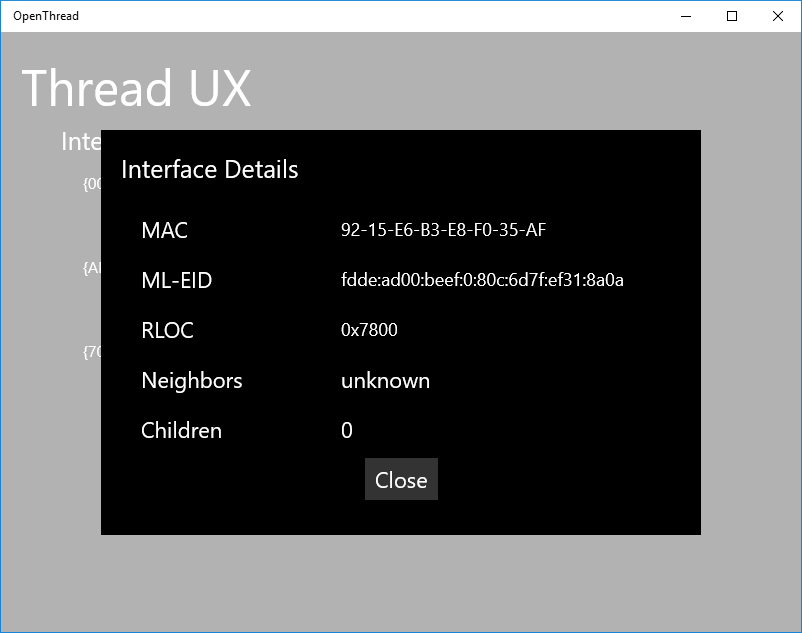
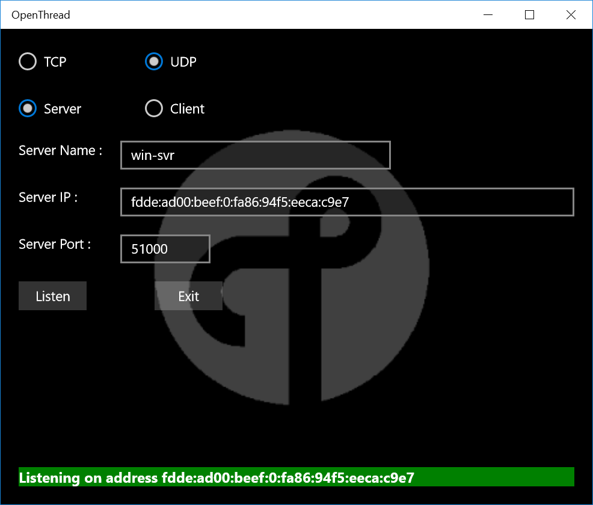
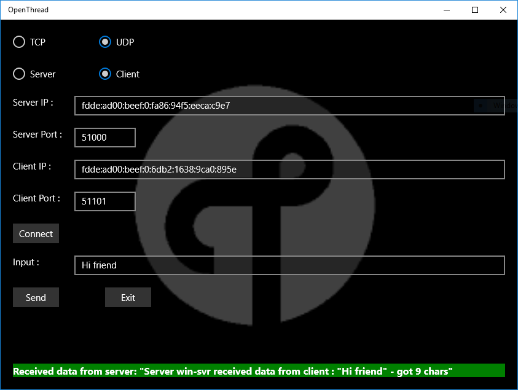

# OpenThread App for Windows #

This sample app provides an example of how to interface with the OpenThread API and talk to each other in a
[Universal Windows App](https://developer.microsoft.com/en-us/windows/apps). The app is written in C++ /CX
and provides a simple wrapper around the OpenThread API, hiding the raw C/C++ interface.

The main page of the App is a list of the available interfaces, their current connection state,
their current ML-EID IPv6 address, and buttons to connect/disconnect and to view some more details.

The details list provides some more information, including extended MAC address, RLOC16 and information
about the current children.

The "Talk" button of main page switches the user interface to the talk fuctionality. This app acts
either as a server or a client role and talks to each other over a TCP or a UDP protocol.

The server listens to the clients.

The client sends a message to the server and the server echos that message back to the client.

