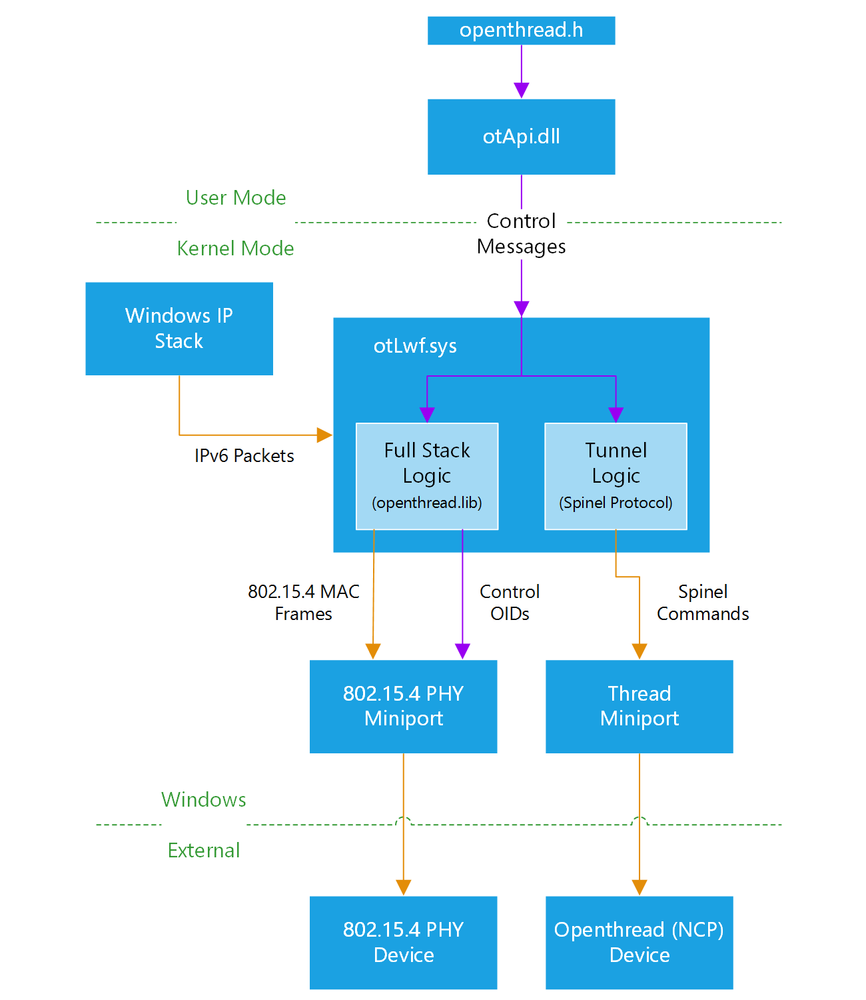

# OpenThread on Windows #

These components are the building blocks to get OpenThread integrated into the Windows
networking stack and provide an interface for applications to control it.

## Architecture ##

[ndis]: https://msdn.microsoft.com/en-us/windows/hardware/drivers/network/ndis-drivers
[lwf]: https://msdn.microsoft.com/en-us/windows/hardware/drivers/network/ndis-filter-drivers
[miniport]: https://msdn.microsoft.com/en-us/windows/hardware/drivers/network/ndis-miniport-drivers2
[ioctl]: https://msdn.microsoft.com/en-us/library/windows/desktop/aa363219(v=vs.85).aspx
[oid]: https://msdn.microsoft.com/en-us/library/windows/hardware/ff566707(v=vs.85).aspx
[nbl]: https://msdn.microsoft.com/en-us/windows/hardware/drivers/network/net-buffer-architecture

This design allows for support of both simple radio devices and devices running the complete
OpenThread stack.

### otApi.dll ###

This is the dynamic libray for applications to control the OpenThread stack from user mode. It
exposes all the control path APIs from `openthread.h`. It interfaces with the driver by the use
of [IOCTL][ioctl]s. The IOCTLs allow otApi.dll to serialize and send commands, and poll for notifications,
which can then be returned back to the client.

### otLwf.sys ###

This is where most of the real logic lives. `otLwf.sys` is an [NDIS][ndis] Light Weight Filter ([LWF][lwf]) driver.
It plugs into the networking stack, binding to a protocol driver (TCPIP) at the top, and an NDIS [Miniport][miniport]
at the bottom. It's job is to take IPv6 packets from TCPIP and pass the necessary data down to the Miniport
in order to send the packets out over the network.

`otLwf.sys` supports operating in two modes: Full Stack and Tunnel. Full Stack mode is where OpenThread is
running on the host (in Windows) and a simple radio device is connected externally. Tunnel mode is where
OpenThread is running on the external device and Windows is merely a pass through for commands and packets.

In both cases, `otLwf.sys` uses the Spinel command interface for interacting with the connected device. When operating
in Full Stack mode, `otLwf.sys` uses only the low level PHY/MAC commands. In Tunnel mode, it uses the higher layer
Spinel commands and lets the device manage the actual Thread stack.

### ottmp.sys ###

This is the component responsible passing the Spinel commands from `otLwf.sys` down to the device. It is responsible
for abstracting the actual mechanism (USB, Serial, SPI) used for communicating with the device. It handles the device
arrival/removal and the encoding/decoding of data when communicating with it. The current implementation only handles
Serial devices.

### Device ###

Windows supports OpenThread devices that implement the Spinel protocol. It supports devices that support either the raw
link-layer PHY/MAC commands and devices that support the Thread commands (and devices that support both). By default,
Windows will operate in Full Stack mode, only sending raw link-layer commands.

