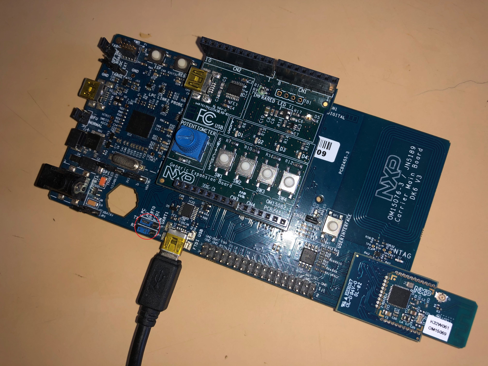
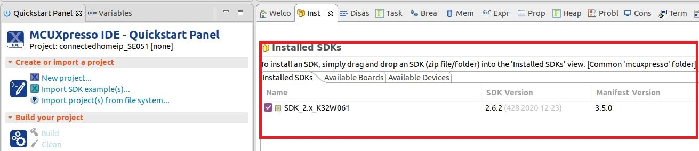
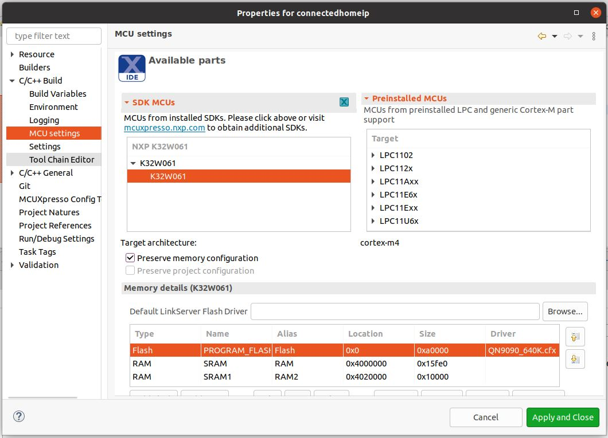
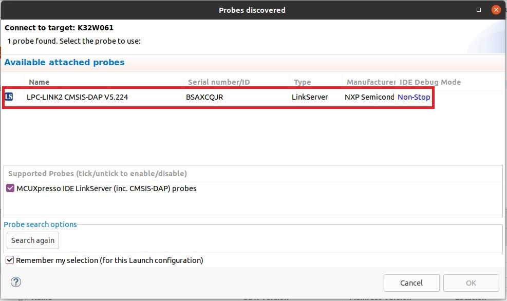
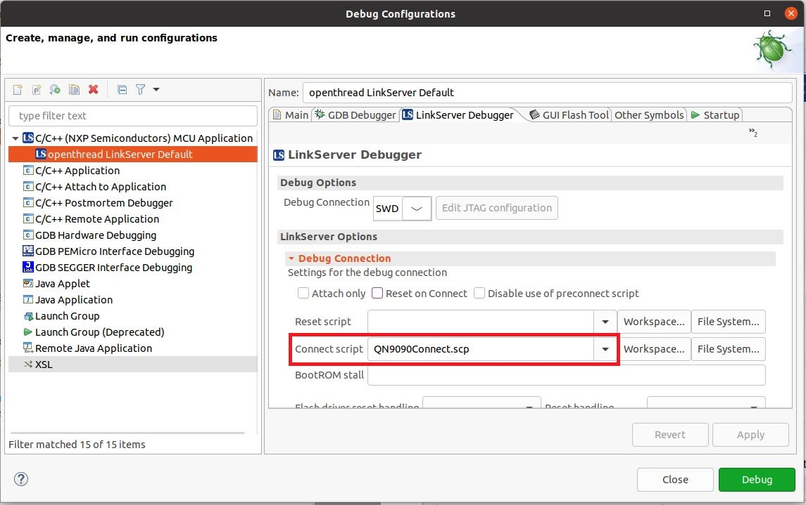
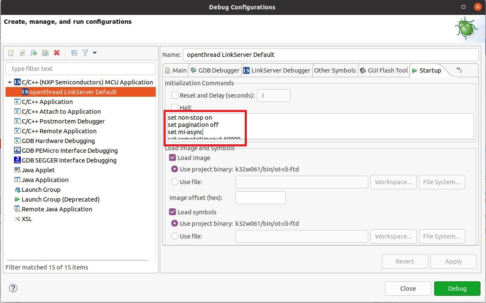
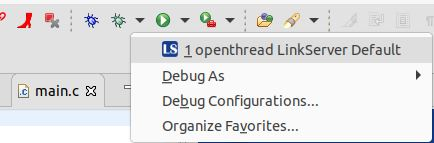

# OpenThread on NXP JN5189 Example

This directory contains example platform drivers for the [NXP JN5189][jn5189] based on [JN5189-DK006][jn5189-dk006] hardware platform.

The example platform drivers are intended to present the minimal code necessary to support OpenThread. As a result, the example platform drivers do not necessarily highlight the platform's full capabilities.

[jn5189]: https://www.nxp.com/products/wireless/thread/jn5189-88-t-high-performance-and-ultra-low-power-mcus-for-zigbee-and-thread-with-built-in-nfc-option:JN5189_88_T
[jn5189-dk006]: https://www.nxp.com/document/guide/getting-started-with-jn5189:GS-JN5189

## Toolchain

OpenThread environment is suited to be run on a Linux-based OS. Recommended OS is Ubuntu 18.04.2 LTS. Download and install the [MCUXpresso IDE][mcuxpresso ide].

[mcuxpresso ide]: https://www.nxp.com/support/developer-resources/software-development-tools/mcuxpresso-software-and-tools/mcuxpresso-integrated-development-environment-ide:MCUXpresso-IDE

In a Bash terminal (found, for example, in Ubuntu OS), follow these instructions to install the GNU toolchain and other dependencies.

```bash
$ cd <path-to-openthread>
$ ./script/bootstrap
```

If a network connection timeout is encountered, re-run the script.

Python-pip is also required for the build. User can install it by running "sudo apt-get install Python-pip" in bash. After installing Python-pip, execute "pip install pycryptodome" in bash. This is needed for signing the built binary in order to load it on the board. Also, pycrypto "pip install pycrypto" is required for PKCS1.

Windows 10 offers the possibility of running bash by installing "Ubuntu on Windows" from Microsoft Store. This application allows the user to use Ubuntu Terminal and run Ubuntu command line utilities including bash, ssh, git, apt and many more. If this option is used, it is recommended to add instructions for the path mapping in MCUXpresso IDE. This can be done after adding the project to the workspace by going to Run->"Debug Configuration"->"C/C++(NXP Semiconductors) MCU Application"->Source->Add. Then the user should create a path mapping such that MCUXpresso IDE will find the mount point for the "Ubuntu in Windows" subsystem. For example, user can enter compilation path recognized by Ubuntu as /mnt/c/<path-to-openthread>, while equivalent "Local file system path" is C:/<path-to-openthread>. This example assumes that the openthread package is installed on the C drive.

## Build Examples

```bash
$ cd <path-to-openthread>
$ ./bootstrap
$ make -f examples/Makefile-jn5189
```

After a successful build, the `elf` files are found in `<path-to-openthread>/output/jn5189/bin`.

## Flash Binaries

OpenThread example application compiled binaries can be found in `<path-to-openthread>/output/jn5189/bin` and include FTD (Full Thread Device), MTD (Minimal Thread Device), variants of CLI and NCP/RCP applications. If only flashing is needed then DK6 Flash Programmer can be used. Otherwise, if also debugging capabilities are needed then MCUXpresso IDE should be used.

### Using DK6Programmer

Connect to the DK6 board by plugging a mini-USB cable to the connector marked with _FTDI USB_. Also, make sure that jumpers JP4/JP7 are situated in the middle position (_JN UART0 - FTDI_).



DK6 Flash Programmer can be found inside the [SDK][sdk_mcux] at path `tools/JN-SW-4407-DK6-Flash-Programmer`. This is a Windows application that can be installed using the .exe file. Once the application is installed, the COM port for JN5189 must be identified:

```
C:\nxp\DK6ProductionFlashProgrammer>DK6Programmer.exe  --list
Available connections:
COM29
```

Once the COM port is identified, the required binary can be flashed:

```
C:\nxp\DK6ProductionFlashProgrammer>DK6Programmer.exe -s COM29 -p ot-rcp.bin
```

[sdk_mcux]: https://mcuxpresso.nxp.com/en/welcome

### Using MCUXpresso IDE

Connect to the DK6 board by plugging a mini-USB cable to the connector marked with _TARGET_. Also, make sure that jumpers JP4/JP7 are situated in the leftmost position (_LPC-JN UART0_).


In order to flash the application for debugging we recommend using [MCUXpresso IDE (version >= 11.0.0)](https://www.nxp.com/design/software/development-software/mcuxpresso-software-and-tools-/mcuxpresso-integrated-development-environment-ide:MCUXpresso-IDE?tab=Design_Tools_Tab).

- Import the previously downloaded NXP SDK into MCUXpresso IDE. This can be done by drag-and-dropping the SDK archive into MCUXpresso IDE's _Installed SDKs_ tab:



- Import OpenThread repo in MCUXpresso IDE as Makefile Project. Use _none_ as _Toolchain for Indexer Settings_:

```
File -> Import -> C/C++ -> Existing Code as Makefile Project
```

- Configure MCU Settings:

```
Right click on the Project -> Properties -> C/C++ Build -> MCU Settings -> Select K32W061 -> Apply & Close
```



- Configure the toolchain editor:

```
Right click on the Project -> C/C++ Build-> Tool Chain Editor -> NXP MCU Tools -> Apply & Close
```


- Create a debug configuration:

```
Right click on the Project -> Debug -> As->MCUXpresso IDE LinkServer (inc. CMSIS-DAP) probes -> OK -> Select elf file
```



- Set the _Connect script_ for the debug configuration to _QN9090connect.scp_ from the dropdown list:

```
Right click on the Project -> Debug As -> Debug configurations... -> LinkServer Debugger
```



- Set the _Initialization Commands_ to:

```
Right click on the Project -> Debug As -> Debug configurations... -> Startup

set non-stop on
set pagination off
set mi-async
set remotetimeout 60000
##target_extended_remote##
set mem inaccessible-by-default ${mem.access}
mon ondisconnect ${ondisconnect}
set arm force-mode thumb
${load}
```



- Set the _vector.catch_ value to _false_ inside the .launch file:

```
Right click on the Project -> Utilities -> Open Directory Browser here -> edit *.launch file:

<booleanAttribute key="vector.catch" value="false"/>

```

- Debug using the newly created configuration file:



[cmsis-dap]: https://os.mbed.com/handbook/CMSIS-DAP

## Running the example

1. Prepare two boards with the flashed `CLI Example` (as shown above). Make sure that the JN4 jumper is set to RX and the JN7 jumper is set to TX, connecting the LPC and JN UART0 pins.
2. The CLI example uses UART connection. To view raw UART output, start a terminal emulator like PuTTY and connect to the used COM port with the following UART settings:

   - Baud rate: 115200
   - 8 data bits
   - 1 stop bit
   - No parity
   - No flow control

3. Open a terminal connection on the first board and start a new Thread network.

```bash
> panid 0xabcd
Done
> ifconfig up
Done
> thread start
Done
```

4. After a couple of seconds the node will become a Leader of the network.

```bash
> state
Leader
```

5. Open a terminal connection on the second board and attach a node to the network.

```bash
> panid 0xabcd
Done
> ifconfig up
Done
> thread start
Done
```

6. After a couple of seconds the second node will attach and become a Child.

```bash
> state
Child
```

7. List all IPv6 addresses of the first board.

```bash
> ipaddr
fdde:ad00:beef:0:0:ff:fe00:fc00
fdde:ad00:beef:0:0:ff:fe00:9c00
fdde:ad00:beef:0:4bcb:73a5:7c28:318e
fe80:0:0:0:5c91:c61:b67c:271c
```

8. Choose one of them and send an ICMPv6 ping from the second board.

```bash
> ping fdde:ad00:beef:0:0:ff:fe00:fc00
16 bytes from fdde:ad00:beef:0:0:ff:fe00:fc00: icmp_seq=1 hlim=64 time=8ms
```

For a list of all available commands, visit [OpenThread CLI Reference README.md][cli].

[cli]: https://github.com/openthread/openthread/blob/master/src/cli/README.md
